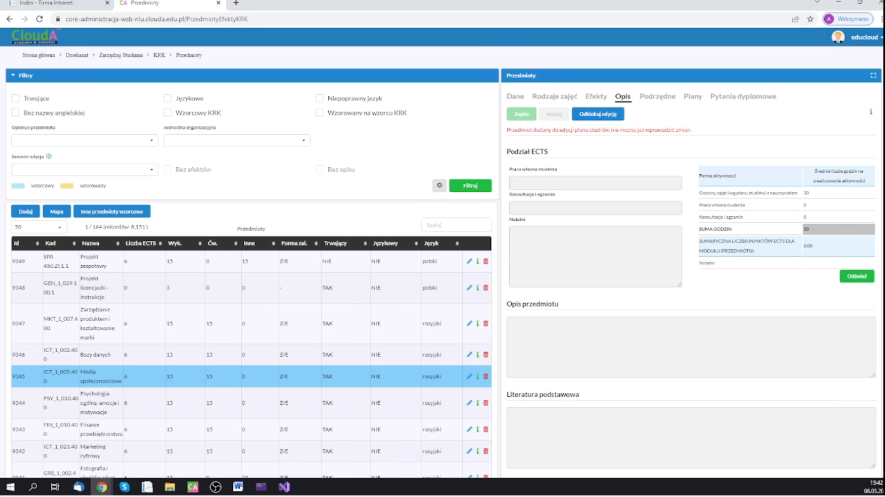
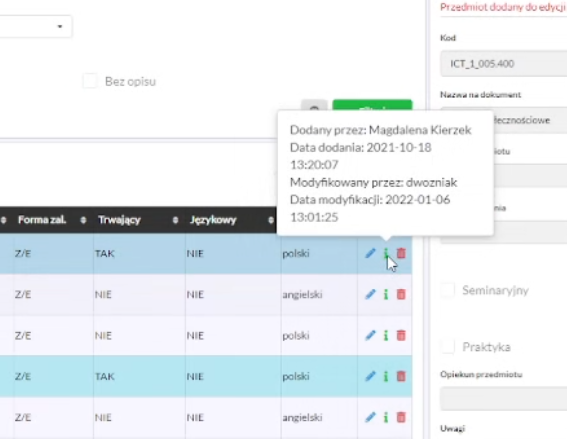

    <h1>.NET Core Shop</h1>
    <h3>
        <a href="#">
            Live demo
        </a>
         | 
        <a href="https://github.com/everstudybee/s6-dotnet-core-shop">
            GitHub
        </a>
    </h3>
    
Web app - Shop

    
<b>Status:</b> 🛠️ The application is in active development 🛠️

     
    
Technologies and tools:

    

        
        
        
        
        
        
        
        
        
        
        
        
        
    

 

## APPLICATION DESCRIPTION

The application is a simple online store in which there are separate projects for the application for the customer, the administrative part and database classes.

1. The code from each part is tagged in Git.
2. All steps are listed in the README.md file.
3. Each Git commit is also described in English.

## Documentation of the project

### Git, versioning and tagging

1. [Course Git [PL]](https://youtube.com/playlist?list=PLj-pbEqbjo6AKsJ8oE2pvIqsb15mxdrxs)
2. [Conventional Commits - Nazewnictwo commit w Git](https://www.conventionalcommits.org/en/v1.0.0/)
3. [Semantic Versioning - Numerowanie wersji](https://semver.org/)
4. [Tagging - Git, Releases - GitHub](https://youtu.be/Wq_zrz7jV80)

### Frameworks CSS

1. [ASP.NET Core documentation page](https://docs.microsoft.com/en-us/aspnet/core/?view=aspnetcore-6.0)
2. [Material Design - project website](https://material.io/)
   1. [Material Design - Web Develop](https://material.io/develop/web)
   2. [Mateerialize - CSS framework based on Material Design](https://materializecss.com/)
3. [Bootstrap](https://getbootstrap.com/)
4. [Material Design for Bootstrap v5 & v4](https://mdbootstrap.com/)
5. [Pure.CSS - light CSS framework](https://purecss.io/)
6. Frameworks overview
   1. [9 Best CSS Frameworks in 2022](https://athemes.com/collections/best-css-frameworks/)
   2. [20 Best Material Design CSS Frameworks for Websites](https://superdevresources.com/material-design-web-ui-frameworks/)

### Code-first

One of the ways to create databases.

1. [Tutorial: Get Started with Entity Framework 6 Code First using MVC 5](https://docs.microsoft.com/en-us/aspnet/mvc/overview/getting-started/getting-started-with-ef-using-mvc/creating-an-entity-framework-data-model-for-an-asp-net-mvc-application)
2. [Tutorial: Code First Approach in ASP.NET Core MVC with EF](https://medium.com/c-sharp-progarmming/tutorial-code-first-approach-in-asp-net-core-mvc-with-ef-5baf5af696e9)
3. [Tutorial: Code First Migrations](https://docs.microsoft.com/en-us/ef/ef6/modeling/code-first/migrations/)
4. [Development Approaches with Entity Framework](https://www.javatpoint.com/development-approaches-with-entity-framework)
5. [Code-First Approach With ASP.NET MVC Framework](https://www.c-sharpcorner.com/article/code-first-approach-with-asp-net-mvc-framework/)

### Microsoft documentation

1. [Entity Framework Core](https://docs.microsoft.com/en-us/ef/core/)
2. [Entity Properties](https://docs.microsoft.com/en-us/ef/core/modeling/entity-properties?tabs=data-annotations%2Cwithout-nrt)
3. [ASP.NET documentation](https://docs.microsoft.com/en-us/aspnet/core/?view=aspnetcore-6.0)

### Data Annotations

1. [Part 6: Using Data Annotations for Model Validation](https://docs.microsoft.com/en-us/aspnet/mvc/overview/older-versions/mvc-music-store/mvc-music-store-part-6)
2. [Model Validation Using Data Annotations In ASP.NET MVC](https://www.c-sharpcorner.com/article/model-validation-using-data-annotations-in-asp-net-mvc/)

<h2 class="movie">W1 - 2022-02-20</h2>

## PRZYKŁADOWY PROJEKT BEZ MVC

### Znaczniki HTML w ASP.NET Core
feat: play with razor and html tags

1. Dodaj nowy projekt `ASP.NET Core Web App`, pozostałe opcje domyślne
2. Zmodyfikuj kod widoku `Index.cshtml` - treść strona startowa
   - Dodanie kilku znaczników HTML

### Dodawanie i Modyfikowanie styli CSS
feat: play with _Layout.cshtml, Index.cshtml and site.css

1. Dodaj nowy projekt `ASP.NET Core Web App`, pozostałe opcje domyślne
2. Zmodyfikuj kod widoku `Index.cshtml` - treść strony startowej
3. Style, js i dodatkowe biblioteki takie jak Bootstrap są w folderze `wwwroot`
4. Plik `_Layout.schtml` odpowiada za szablon strony
   - Znacznik `@RenderBody()` w treści pliku oznacza miejsce, gdzie będzie wklejana treść poszczególnych stron
   - Odpowiednikiem `_Layout.cshtml` w aplikacjach desktopowych jest `generic.xaml`
   - W `generic.xaml` odpowiednikiem `@RenderBody()` jest `<ContentPresenter>`
   - Jeśli jest jeden layout to jest domyślny, jeśli jest więcej to można decydować, która strona korzysta z którego layoutu
5. Zmodyfikuj plik `site.css` - który odpowiada za style CSS całego projektu

### Procedura tworzenia projektu zgodnie ze wzorcem MVC
feat: create ASP.NET Core Web App MVC

1. Model MVC to model projektowy `Model > View > Controller`
   - `Model` zawiera klasy do zarządzania bazą danych oraz klasy logiki biznesowej
   - `Widok` zawiera strony napisane w HTML raz z wstrzykiwanym kodem C#'owym i są renderowane za pomocą silnika `Razor`
   - `Kontroler` zawiera klasy pośredniczące między modelem a widokiem
   - We wzorcu projektowym MVVM jednemu View-Model odpowiadał jeden Widok. We wzorcu projektowym MVC jednemu Kontrolerowi odpowiada wiele Widoków
   - Każdy Widok na ogół ma osobną funkcję w Kontrolerze. Jeden Kontroler działa na rzecz wielu widoków.
2. Dodaj nowy projekt `ASP.NET Core Web App (Model-VIew-Controller)`, pozostałe opcje domyślne
3. Główne elementy projektu `ASP.NET Core Web App (Model-VIew-Controller)`
   - `Views > Home > Index.cshtml` - strona otwierająca się jako pierwsza
   - `Views > Shared > _Layout.cshtml` - szablon domyślny dla wszystkich stron
   - `wwwroot > css > site.css` - główny plik styli CSS
   - `Controllers > HomeController.cs > funkcja Index()` - główny kontroler sterujący widokiem `Index.cshtml`

<h2 class="movie">W2 - 2022-02-20</h2>

## SOLUCJA OD POCZĄTKU. ROZWÓJ PRJEKTU Firma.PortalWWW

### feat: przygotuj nowa solucje z projektami
feat: prepare a new solution with projects

1. Dodaj do projektu `Blank Solution` - solucja to zbiór projektów
2. Dodaj nowy projekt `ASP.NET Core Web App (Model-VIew-Controller)` - nazwa `Firma.PortalWWW`
   - Projekt ten jest aplikacją internetową dedykowaną klientom
3. Dodaj nowy projekt `ASP.NET Core Web App (Model-VIew-Controller)` - nazwa `Firma.Intranet`
   - Projekt ten jest aplikacją internetową dedykowaną pracownikom
4. `PPM na Firma.Intranet > Set as Startup Project` - ustaw `Firma.Intranet` jako projekt startowy
   - Nazwa aktywnego projektu będzie pogrubiona w Solution Explorer

### feat: zintegruj materializecss z Firma.PortalWWW
feat: integrate materializecss with Firma.PortalWWW

1. Pobierz framework materializecss (link u góry w Dokumentacji)
2. Ustaw projekt Firma.PortalWWW jako Startup Project
3. Przeciągnij rozpakowany folder `materialize` do `Firma.PortalWWW > wwwroot > lib`

### feat: podepnij materializecss do _Layout.cshtml i uaktualnij biblioteki
feat: connect materializcsse to _Layout.cshtml and update libraries

1. Pobierz wybrany template materialize np. [Starter Template](https://materializecss.com/getting-started.html)
2. Edytuj `Frima.PortalWWW > Shared > _Layout.cshtml` i przekopiuj odpowiednie fragmenty z `template > index.html`
   - `head` integruj style css potrzebne do działania template. Zweryfikować dodatkowe pliki z dedykowanym CSS
      1. Dodaj dodatkowy kod CSS do `Firma.PortalWWW > wwwroot > lib > css > site.css`
   - `body` integruj zawartość template strony
   - `script` integruj odpowiednie skrypty potrzebne do działania template
        1. Dodaj odpowiednią wersję jQuery do `Firma.PortalWWW > wwwroot > lib > jquery > dist`
        2. Dodaj dodatkowy kod JavaScript do `Firma.PortalWWW > wwwroot > lib > js > site.js`
   - W pliku `_Layout.cshtml` w miejscu w którym ma się wklejać renderowana treść strony dodaj linijkę `@RenderBody()`
3. Edytuj plik `FirmaPortalWWW > Views > Home > Index.cshtml` i dodaj odpowiednią treść strony `Home` z uwzględnieniem nowych klas CSS z materialize
4. Usuń nieużywane przez template skrypty z `Firma.PortalWWW > wwwroot > lib`
    - Bootstrap

### feat: dodaj linki do menu w _Layout.cshtml
feat: add links to the menu in _Layout.cshtml

1. Tworzenie linku do strony `@Html.ActionLink("Prywatność","Privacy","Home")`
   - `Prywatność` - anchor text `linkText`
   - `Privacy` - nazwa funkcji wyświetlającej daną stronę w kontrolerze `actionName`
   - `Home` - nazwa kontrolera `controllerName`

### feat: dodaj nowe widoki (strony) do projektu
feat: add new views (pages) to the project

1. W pliku `HomeController.cs` dodaj funkcję o nazwie takiej jak nowy widok np. About
2. `PPM > na funkcję About > Add View > Razor View - Empty` i nadajemy nazwę About. W folderze `Home` pojawi się nowy plik About.cshtml
3. Edytuj wszystkie dodane strony i utwórz ich treść wzorując się na `Index.cshtml`
4. Edytuj `_Layout.cshtml` i w sekcji nawigacji dodaj linki do dodanych stron zgodnie z procedurą z poprzedniego commit

### feat: dodaj przykladowe komponenty materializecss
feat: add sample materializecss components

1. Dodaj `Fixed Navbar` do `_Layout.cshtml` [Fixed Navbar](https://materializecss.com/navbar.html)
2. Dodaj `Card Panel` do `About.cshtml` [Card Panel](https://materializecss.com/cards.html)
3. Dodaj `FABs in Cards` do `Privacy.cshtml` [Card Panel](https://materializecss.com/cards.html)
4. Dodaj `Card Reveal` do `Contact.cshtml` [Card Panel](https://materializecss.com/cards.html)

## ROZWÓJ PROJEKTU Firma.Intranet

Bazę danych tworzymy w oparciu o podejście Code-First. Więcej informacji w dziale [dokumentacja](#code-first).

### feat: dodaj do strona.cs properties oraz annotations w projekcie Firma.Intranet
feat: add properties and annotations to strona.cs in Firma.Intranet project

1. Ustaw jako aktywny projekt `Firma.Intranet`
2. Utwórz folder `CMS` w folderze `Models`
3. Utwórz w folderze `CMS` klasę o nazwie `Strona.cs`. Properties tej klasy odpowiadają elementom jakie zawiera każda strona. Strona (podstrona) w tym wypadku oznacza treść i link do tej treści, który będzie umieszczony w szablonie.
4. Dodaj do klasy `Strona.cs` properties, które będą odpowiedzialne za elementy strony
   - `IdStrony` - identyfikator strony w bazie danych
   - `LinkTytul` - anchor text linku do strony
   - `Tytul` - tytuł strony, może też być w treści
   - `Tresc` - treść strony z całym HTML
   - `Pozycja` - pozycja strony w menu
5. Dodaj do każdego properties `annotations`, które odpowiadają za konfigurację bazy danych. Linki do dokumentacji w sekcji `Dokumentacja > Data Annotations`
   - `[Key]` - klucz główny w bazie danych
   - `[Required]` - oznacza, że pole jest wymagane
      - `[Required(ErrorMessage = "Wpisz tytuł donośnika")]` - komunikat błędu, w domyślnym szablonie wyświetla się pod danym elementem w formularzu
   - `[MaxLength]` - maksymalna długość pola
      - `[MaxLength(10, ErrorMessage = "Tytuł powinien zawierać max. 10 znaków")]` - weryfikuje, czy wpisany tekst nie jest dłuższy niż 10 znaków i ewentualnie wyświetla odpowiedni komunikat. **To pole jest ważne w menu, by tekst zawsze się mieścił lub w tytułach**
   - `[Display]` - podczas wyświetlania zamienia nazwę properties na podany string. Nazwa properties jest taka sama jak nazwa kolumny w bazie danych i nie powinna zawierać polskich znaków. Używamy gdy nazwa pola jest inna niż wyświetlana
      - `[Display(Name = "Tytuł odnośnika")]` - podany string zamienia nazwę properties
   - `[Column]` - decydujemy, że w bazie danych ten properties będzie typu nvarchar(MAX)

<h2 class="movie">W3 - 2022-03-06</h2>

### feat: dodaj klasy Aktualnosc.cs oraz Parametr.cs
feat: add classes Aktualnosc.cs and Parametr.cs

1. Klasy tworzymy analogicznie do klasy Strona.cs
2. Tabela parametry będzie służyła do przechowywania pojedynczych tekstów na danej stronie
3. W projekcie może być kilka tabel z parametrami np. parametry ogólne, parametry finansowe i w każdym module aplikacji może być oddzielna tabela. Każdy projekt może mieć wtedy oddzielną tabelę parametry + parametry ogólne np. z nazwą firmy, adresem itd, które dotyczą całej aplikacji.
4. Innym sposobem podejścia może być jedna tabela parametry z dodatkowym polem, gdzie dodamy informacje, gdzie ten parametr zostanie wykorzystany.
5. Na koniec kompilujemy projekt.

### feat: utworz kontroler klasy Aktualnosc.cs
feat: create a controller of the class Aktualnosc.cs

1.`PPM > Controllers > Add > Controller > MVC Controller with views, using Entity Framework`
   - `Model class` - `Aktualnosc (Firma.Intranet.Model.CMS)`
   - `Data context class` - dodajemy plusem i `New data context type` - `Firma.Intranet.Data.FirmaIntranetContext` - tworzy się automatycznie
   - `Views` - wszystko zostawione domyślnie, czyli pola wyboru 3x zaznaczone i pusty input pod spodem
   - `Controller name` - `AktualnoscController` bez "s", ale nazwa dowolna. "s" dodawane jest automatycznie by podkreślić liczbę mnogą w angielskim.
2. `Views > Aktualnosc` - Widoki należy robić dedykowane i zmienić kod wygenerowany automatycznie
3. Zalecane jest w AktualnoscController.cs zrobić dziedziczenie tak jak było na Desktopach i aby dziedziczyły po DatabaseController

### feat: utworz kontrolery klas Strona.cs
feat: create a controller of the class Strona.cs

1. `PPM > Controllers > Add > Controller > MVC Controller with views, using Entity Framework`
   - `Model class` - `Aktualnosc (Frima.Intranet.Model.CMS)`
   - `Data context class` - jeśli dodaliśmy już wcześniej context `Frma.Intranet.Data.FirmaIntranetContext` to nie dodajemy po raz drugi, ponieważ utworzyło by się drugie połączenie do bazy
   - `Views` - wszystko zostawione domyślnie, czyli pola wyboru 3x zaznaczone i pusty input pod spodem
   - `Controller name` - `AktualnoscController` bez "s", ale nazwa dowolna. "s" dodawane jest automatycznie by podkreślić liczbę mnogą w angielskim.
2. `Views > Nazwa kontrolera` - Widoki należy robić dedykowane i zmienić kod wygenerowany automatycznie
3. Zalecane jest w NazwaKontroleraController.cs zrobić dziedziczenie tak jak było na Desktopach i aby dziedziczyły po DatabaseController

### feat: utworz kontrolery klas Parametr.cs
feat: create a controller of the class Parametr.cs

1. `PPM > Controllers > Add > Controller > MVC Controller with views, using Entity Framework`
   - `Model class` - `Aktualnosc (Frima.Intranet.Model.CMS)`
   - `Data context class` - jeśli dodaliśmy już wcześniej context `Frma.Intranet.Data.FirmaIntranetContext` to nie dodajemy po raz drugi, ponieważ utworzyło by się drugie połączenie do bazy
   - `Views` - wszystko zostawione domyślnie, czyli pola wyboru 3x zaznaczone i pusty input pod spodem
   - `Controller name` - `AktualnoscController` bez "s", ale nazwa dowolna. "s" dodawane jest automatycznie by podkreślić liczbę mnogą w angielskim.
2. `Views > Nazwa kontrolera` - Widoki należy robić dedykowane i zmienić kod wygenerowany automatycznie
3. Zalecane jest w NazwaKontroleraController.cs zrobić dziedziczenie tak jak było na Desktopach i aby dziedziczyły po DateBasebontroller

### Uwagi do Kontrolerów

1. Najlepiej zrobić dziedziczenie i powtarzający się kod wydzielić do klasy DatabaseController.
2. Bardzo łatwo można wydzielić funkcję Creat(), bo zwraca tylko widok.
3. Podczas tworzenia kontrolera tworzy się plik `Data > FirmaIntranetContext.cs` w którym zapisywane są poszczególne DbSet. Jest to klasa do zarządzania bazą danych.
4. Plik `Firma.Intranet > appsettings.json` zawiera nazwę bazy danych i konfigurację serwera.

### Uwagi do Widoków

1. W internecie jest wiele gotowych przykładów Low Code z gotowymi tabelami i kontrolkami.
2. Przykład zapytania "razor table template demo".

### feat: dodaj linki do nowych stron do pliku _Layout.cshtml
feat: add links to new pages to the _Layout.cshtml file

1. `Views > Shared > _Layout.cshtml` - zmieniamy sekcję nawigacyjną strony by dodać linki do utworzonych wcześniej widoków.
2. Została zastosowana druga metoda tworzenia linków:
   - Skopiuj jeden z już istniejących linków
   - `asp-controller` - nazwa kontrolera
   - `asp-action` - nazwa funkcji w kontrolerze, która uruchamia dany widok
3 . Dokonaj kompilacji.

### feat: wykonaj w konsoli NuGet polecenie Add-Migration InitialCreate
feat: execute the command Add-Migration InitialCreate in the NuGet console

1. `Data > FirmaIntranetContext.cs` - główna klasa odpowiedzialna za zarządzanie bazą danych, każdy nowy Model jest tu dopisywany i tworzony jest z niego nowy DbSet
2. `appsettings.json` - został utworzony wpis, który definiuje bazę danych, ale w tym momencie baza jeszcze nie jest utworzona
3. `Tools > NuGet Package Manager > Package Manager Console` - wejdź do konsoli
4. Ustaw odpowiedni projekt w konsoli
5. `Add-Migration InitialCreate` - podajemy to polecenie w konsoli dla wybranego projektu
6. Został utworzony folder `Migration` a w nim pliki migracyjny

### feat: utworz baze danych dla projektu Firma.Intranet
feat: create a database for the Firma.Intranet project

1. `Tools > NuGet Package Manager > Package Manager Console` - wejdź do konsoli
2. Ustaw odpowiedni projekt w konsoli
3. Nie trzeba uruchamiać Servera SQL
4. `Update-Database -verbose` - tworzymy bazę danych, -verbose powoduje, że w konsoli wyświetla się cały SQL przesyłany do bazy
5. `View > SQL Server Object Explorer` - można zobaczyć wszystkie lokalne bazy danych
6. W pliku `appsettings.json` możemy podejrzeć nazwę naszej bazy danych
7. `PPM > Wybrana tabela > View Data` - można podejrzeć dane tak jak w SSMS
8. Do lokalnej bazy danych można się też dostać za pomocą SSMS, ale nie przerabialiśmy tego
9. Można też eksportować bazę danych z `SQL Server Object Explorer (SSOE)` do `SQL Server Management Studio (SSMS)`
10. `C:\Users\<użytkownik>\<baza>.mdf` - (SQL Server Database Primary Data File) plik do lokalnej bazy danych. Plik `<baza>.ldf` (SQL Server Database Transaction Log File) zawiera logi bazy danych i nie trzeba go eksportować.
11. Podłączenie SSMS do lokalnej bazy danych
    - `Serwer type > Database Engine` - wybór rodzaju bazy danych
    - `Server name > (localdb)\MSSQLLocalDB` - wybór lokalnej bazy danych
       - `'C:\Program Files\Microsoft SQL Server\130\Tools\Bin\SqlLocalDB.exe' info mssqllocaldb` - uruchomienie tej komendy z terminala wyświetli info o lokalnej bazie danych. `Instance pipe name: np:\\.\pipe\LOCALDB#25058595\tsql\query` `np:\\` można alternatywnie podać w `Server name`
    - `Connect` - podłączenie się do lokalnej bazy danych
12. Przegląd logów LocalDB/SQLEXPRESS
    - `Management > SQL Server Logs` - przegląd bazy danych

### Uwagi do całej solucji

1. Każdy tekst na stronie będzie sterowany z Intranetu.
2. Baza danych ma być obsługiwana z oddzielnego projektu, tak aby wszystkie inne projekty z solucji korzystały z tego samego projektu bazy danych
3. Wzorcowe tabele są prezentowane na W3 - 01:50:37

<h2 class="movie">W4 - 2022-03-06</h2>

## WYDZIEL BAZĘ DANYCH DO ODDZIELNEGO POJEKTU Firma.Data

### feat: utworz nowy projekt dla wspolnej bazy danych
feat: create a new project for a common database

1. `PPM na Solucji > Add > New project` - do solucji dodaj nowy projekt `Class Library`
   - wyszukaj odpowiedni template projektu
   - Projekt złożony tylko z klas bazy danych
2. Od wersji .NET 5 zniknął dopisek Core z nazwy [.NET Wiki](https://en.wikipedia.org/wiki/.NET)

### Uwagi do wydzielonego projektu

1. Dzięki wydzieleniu do oddzielnego projektu np. klas walidacyjnych, testowych lub logiki biznesowej można potem ten projekt wykorzystać w dowolnej solucji, wystarczy go podpiąć do solucji i ustawić odpowiednie Dependencies.
2. Wydzielony projekt możemy stosować zarówno do aplikacji desktopowych jak i do webowych lub mobilnych.

### refactor: wydziel baze danych do oddzielnego projektu - stage 1
refactor: extract database into a separate project - stage 1

1. Wydziel bazę danych do oddzielnego projektu tak by wszystkie projekty z solucji korzystały z tego samego projektu bazy danych
2. `PPM na Firma.Data > Add > New Folder > Data` - w projekcie bazy danych dodaj nowy folder
3. Z projektu `Firma.Data` wykasować domyślnie utworzoną klasę
4. `PPM na Data > Add > New Folder > CMS` - dodać kolejny podfolder
5. `PPM na CMS > Add > Class` - dodajemy trzy klasy o nazwach takich samych jak w `Firma.Intranet > Models > CMS`. Treść tych klas ma być taka sama. Zmieniamy widoczność klas z `internal` na `public`.
6. `PPM na Data > Add > New Class > FirmaContext.cs` - dodać klasę, która będzie zawierała to samo co `Firma.Intranet > Data > FirmaIntranetContext.cs`
7. W projekcie `Firma.Intranet` wykasuj foldery `Data`, `Migrations`, `Models > CMS` z ich zawartością

### refactor: wydziel baze danych do oddzielnego projektu - stage 2
refactor: extract database into a separate project - stage 2

1. w `FrimaContext.cs` dodaj dziedziczenie po DbContext i następnie `PPM na DbContext > Quick Actions and Refactorings > Install package 'MicrosoftEntityFrameworkCore' > Install with package manager > wybrać Latest stable 6.0.2`
2. Zrobić `Rebuild` projektu `Firma.Data`
3. `Firma.Intranet > Dependencies > Add Project Reference > Solution > Firma.Data` - dodajemy do projektu `Firma.Intranet` zależność do projektu `Firma.Data`

### refactor: wydziel baze danych do oddzielnego projektu - stage 3
refactor: extract database into a separate project - stage 3

4. Rekompilujemy cały projekt i po kolei klikamy wszystkie błędy i dodajemy odpowiednie `using` oraz zmieniamy nazwy klas na zgodne z `Firma.Data`
5. Wejdź do wszystkich widoków w projekcie `Firma.Intranet` i zmień nagłówek `@model` na zgodny z projektem `Firma.Data`
6. `Firma.Intranet > Program.cs > linia 8 > GetConnectionString` zmieniamy na `FirmaContext` 
7. `Firma.Intranet > appsettings.json > linia 10` należy zmienić `"FirmaIntranetContext"` na `"FirmaContext"`
8. Zmiana nazwy bazy danych
    - `Firma.Intranet > appsettings.json > linia 10` zmień nazwę bazy danych na docelową
    - `SSMS > Dodaj nową bazę` ustaw nazwę na taką samą jak w `Firma.Intranet`
    - Zrób backup dotychczasowej bazy danych
    - Plik z backupem poprzedniej bazy odtwórz w nowej bazie. Konfiguracja znajduje się pod linkiem [How can I clone an SQL Server database](https://stackoverflow.com/a/26265624)

### feat: dodaj klasy Rodzaj.cs i Towar.cs do Firma.Data
feat: add the classes Rodzaj.cs and Towar.cs to Firma.Data

1. `Firma.Data > Data` dodaj folder `Sklep`
2. `Sklep` dodaj klasy `Rodzaj.cs` i `Towar.cs`
3. W nowych klasach zmieniamy `internal` na `public`
4. Dodaj odpowiednie properties do nowych klas

<h2 class="movie">L1 - 2022-03-20</h2>

### feat: dodaj klucz obcy z Rodzaj.cs do Towar.cs 
feat: add the foreign key from Rodzaj.cs to Towar.cs 

1. Edytuj plik `Rodzaj.cs` i zrealizuj relację jeden do wielu. Lista Towarów po stronie jeden (Towar może mieć jeden rodzaj)
2. Edytuj plik `Towar.cs` i zrealizuj relację wiele do jednego. Jedna kategoria może być przypisana do wielu Towarów.
3. Właściwe nazwanie pól powoduje, że nie trzeba dodawać dodatkowej funkcji w pliku `FirmaContext.cs`, o nazwie OnModelCreating(), która jest opisana w linku poniżej
4. [Dokumentacja: Klucz obcy](https://docs.microsoft.com/pl-pl/ef/core/modeling/relationships?tabs=fluent-api%2Cfluent-api-simple-key%2Csimple-key#foreign-key)

### feat: dodaj DbSet do FirmaContext.cs dla Rodzaj.cs i Towar.cs
feat: add DbSet to FirmaContext.cs for Rodzaj.cs and Towar.cs

1. Dodaj wpis DbSet do `FirmaContext.cs` dla klasy `Rodzaj.cs` i `Towar.cs`
2. `Rebuild` cały projekt.

### feat: migruj baze danych wspolna dla Firma.Intranet i Firma.PortalWWW
feat: migrate a database shared by Firma.Intranet and Firma.PortalWWW

1. Działaj na projekcie Firma.Data
2. `Firma.Data > Rebuild`
3. `Firma.Data > Dependencies > NuGet`
4. Zainstaluj `Microsoft.EntityFrameworkCore.Relational` w takiej samej wersji jak `Microsoft.EntityFrameworkCore`
5. Zainstaluj `Microsoft.EntityFrameworkCore.SqlServer` w takiej samej wersji jak `Microsoft.EntityFrameworkCore`
6. Jako aktywny projekt wybieramy `Firma.Intranet > Set as Startup Project` bo tam jest skonfigurowany `ConnectionStrings` do bazy danych
7. Migrację robimy z projektu `Firma.Data` i wybieramy `Packege Manager Console (PMC) > Firma.Data`
8. `Add-Migration InitialCreate` utworzenie migracji z nazwą `InitialCreate`
   - [Docs: Add-Migration](https://docs.microsoft.com/en-us/ef/core/cli/powershell#add-migration) 
9. `Update-database` tworzy bazę danych
   - [Docs: Update-Database](https://docs.microsoft.com/en-us/ef/core/cli/powershell#update-database)

## UTWÓRZ PARTIAL VIEWS

### feat: set zarzadzanie trescia Frima.PortalWWW z Firma.Intranet
feat: set Frima.PortalWWW content management from Firma.Intranet

1. Działaj na projekcie `Firma.PortalWWW`.
2. Dodaj wpis `ConnectionStrings` do pliku `appsettings.json` definiujący z jakiej bazy będzie korzystał ten projekt. Można skopiować wpis z Firma.Intranet.
3. W `Dependencies` dodajemy połącznie do projektu `Firma.Data`.
4. Do pliku `Program.cs` skopiować `using` i `builder.Services.AddDbContext<FirmaContext>` z `Firma.Intranet`. Jest to bindowanie bazy danych.

### feat: dodaj PartialView Odnosniki.cs
feat: add PartialView Odnosniki.cs

1. Zamień odnośniki w menu na `PartialView` i pobieraj je z bazy danych tabela `Strona`.
   - [Docs: Partial Views](https://docs.microsoft.com/en-us/aspnet/core/mvc/views/partial?view=aspnetcore-6.0)
   - [Tutorial: Create and Render Partial Views](https://www.tutorialsteacher.com/mvc/partial-view-in-asp.net-mvc)
2. Działaj na projekcie `Firma.PortalWWW`
2. `PartialView` to część widoku, który może być osadzony w innym widoku
3. `Views > Shared > Add > View > Razor View`  
    - View name: Odnosniki
    - Template: Empty (without model)
    - Create as a partial view
    - Reszta baz zmian
4. Z `_Layout.cshtml` wyciąć fragment odpowiedzialny za generowanie menu i wkleić go do `Odnosniki.cshtml`

### feat: skonfiguruj Odnosniki.cshtml do pobierania danych z bazy danych
feat: configure Odnosniki.cshtml to retrieve data from the database

1. Jeżeli Widok używa kolekcji z bazy danych to dodaj wpis`@model IEnumerable<Firma.Data.Data.CMS.Strona>`. To połączy Widok z odpowiednią bazą danych.
2. W zmiennej `Model` znajduje się kolekcja stron i dzięki temu możemy za pomocą `foreach` wydobyć nazwy linków.
3. Dodaj do sekcji Menu w `_Layout.cshtml` wywołanie PartialView `@await Html.PartialAsync("Odnosniki",(IEnumerable<Firma.Data.Data.CMS.Strona>)ViewBag.ModelStrony)`
4. `ViewBack` lub `ViewData` to "listonosz", który przenosi dane pomiędzy kontrolerem a widokiem.
5. Nazwa po `ViewBag.` może być dowolna, ale musi być taka sama w Kontrolerze i Widoku pobierającym te dane.
4. `ViewBag.ModelStrony` oczekuje na dane do widoku od `HomeController.cs`. Należy w tym pliku dokonać następujących modyfikacji:
    - Dodaj property `_context`
    - Zainicjalizuj `_context` w konstruktorze
    - Do funkcji `Index()` dodaj inicjalizację `ViewBag.ModelStrony`

### feat: dodaj PartialView Aktualnosci.cs bez pobierania danych z bazy
feat: add PartialView Aktualnosci.cs without retrieve data from the database

1. Działaj na projekcie `Firma.PortalWWW`
2. `PartialView` to część widoku, który może być osadzony w innym widoku
3. `Views > Shared > Add > View > Razor View`  
    - View name: Aktualnosci
    - Template: Empty (without model)
    - Create as a partial view
    - Reszta baz zmian
4. Z `Index.cshtml` wyciąć fragment odpowiedzialny za generowanie Aktualnosci i wkleić go do `Aktualnosci.cshtml`
5. Dodać `Aktualnosci.cshtml` do Index.cshtml jako `PartialView`

### feat: przenies tresc PartialView do bazy danych
feat: transfer the contents of Partial View to the database

1. Dodaj do `Firma.Data.Data.CMS > Aktualnosc.cs` pole do przechowywania informacji o ikonie.
2. `Package Manager Console > Add-Migration NazwaMigracji` - utwórz nową migrację ze zmianami bazy danych. W `PMC` ma być wybrane `Firma.Data` aktywny projekt w solucji to `Firma.Intranet`
3. `PMC > Update-database` - update bazę danych.
4. Dodaj w plikach `AktualnoscController.cs > Create() i Edit()`, `Views > Aktulnosc > wszystkie pliki` informację o nowym polu.
5. Skopiuj nazwę ikony, tytuł i treść z `Aktualnosci.cshtml` do bazy danych i ustaw pozostałe parametry.

### feat: zmodyfikuj PartialView Aktualnosci.cshtml aby pobierał dane z bazy
feat: modify Partial View Aktualnosci.cshtml to retrieve data from the database

1. W pliku `Aktualnosci.cshtml` dodaj `@model IEnumerable<Firma.Data.Data.CMS.Aktualnosc>` aby PartialView mógł iterować po Liście, która zawiera Aktualności
2. W pliku `Aktualnosci.cshtml` dodaj pętlę `foreach` aby wypisać Aktualności
3. W pliku `Index.cshtml` który wyświetla ten PartialView, dodaj wpis `@await Html.PartialAsync("Aktualnosci",(IEnumerable<Firma.Data.Data.CMS.Aktualnosc>)ViewBag.ModelAktualnosci)` co umożliwi stronie pobranie danych z kontrolera.
4. Do funkcji `Index()` w `HomeController.cs` dodaj inicjalizację `ViewBag.ModelAktualnosci`

### feat: pobieraj tresc kazdej podstrony z bazy danych
feat: retrieve the content of each subpage from the database

1. Zmodyfikuj metodę `Index()` w pliku `HomeController.cs` tak aby do widoku wysyłała stronę podpiętą pod dany link.
2. Do obiektu który przekazuję do widoku mogę podpiąć dowolną ilość danych jako kolejne properties.
3. Przenieść treść stron do bazy danych.
4. Aby wyświetlać HTML z bazy należy dodać wpis `@Html.Raw(Model.Tresc)`.
5. Przekopiować treść `About.cshtml`, `Privacy.cshtml`, `Contact.html` do bazy danych i usunąć pliki.
6. Usuną z kontrolera funkcje wywołujące następujące widoki `About`, `Privacy`, `Contact`.
7. Aby móc edytować HTML z poziomu `Firma.Intranet` dodać [HTML Editor Control](https://docs.microsoft.com/en-us/aspnet/web-forms/overview/ajax-control-toolkit/htmleditor/how-do-i-use-the-html-editor-control-cs)
8. **TODO:** Aktualności wyświetlają się na każdej podstronie, ponieważ wszystkie linki obsługiwane są przez jeden kontroler `HomeController.cshtml`. Dla każdego nowego rodzaju strony trzeba stworzyć nowy kontroler.

<h2 class="movie">W5 - 2022-04-03</h2>

## UTWÓRZ SKLEP INTERNETOWY

### feat: zbuduj layout dla sklepu internetowego 
feat: build a layout for an online store 

1. Wczęśniej dodaliśmy klasę (model) w projekcie `Firma.Data` o nazwie `Sklep > Rodzaj.cs` i updatowaliśmy bazę danych [link](#feat-dodaj-klasy-rodzajcs-i-towarcs-do-firmadata).
2. Ustawić aktywny projekt w solucji na `Firma.PortalWWW`
3. `Shared > Add new > Razor View empty` nazwa `_SklepLayout.cshtml` - nowy layout dla sklepu
4. Skopiuj layout z pliku `_Layout.cshtml`
   - `@await Html.PartialAsync("RodzajeMenu",(IEnumerable<Firma.Data.Data.Sklep.Rodzaj>)ViewBag.ModelRodzaje)` - zmieniamy wyświetlane menu na rodzaje
   - Dostosuj nowy layout

### feat: stworz kontroler dla sklepu internetowego 
feat: create a controller for an online store

1. Stwórz `Controllers > MVC Controller - Empty > SklepController.cs` pusty kontroler i uzupełnij funkcję Index
2. Stwórz w kontrolerze połączenie do bazy danych
3. Do `ViewBag.ModelRodzaje` pobieramy za pomocą Linq listę kategorii by wyświetlić ją za pomocą PartialView w `_SklepLayout.cshtml`
4. Przy pierwszym uruchomieniu nie ma wybranej kategorii, więc ustawiamy kategorię domyślną. Docelowo będą to produkty promowane
5. Do widoku przekazuję listę towarów z danej kategorii za pomocą `return View(await _context.Towar.Where(t => t.IdRodzaju == id).ToListAsync());`.
6.  Jeśli stworzymy klasę, która będzie miała w sobie i to co ma `ViewBag` i listę towarów z kategorii to możemy utworzyć jeden obiekt z oboma danymi i przekazać go z kontrolera za pomocą tylko metody View(), nie używając `ViewBag`.

### feat: utworz widok dla metody index w SklepController.cs
feat: create a view for the Index method in Store Controller.cs

1. `SklepController.cs > Index > PPM > Add View > Razor View - Empty > Index.cshtml` tworzy widok do kontrolera.
2. Dodaj PartialView dla menu Rodzaje `Views > Shared > Add > View > Razor View`. `RodzajeMenu.cshtml` wzorowany jest na `Odnosniki.cshtml`
    - View name: RodzajeMenu
    - Template: Empty (without model)
    - Create as a partial view
    - Reszta baz zmian
3. Dostosuj `RodzajeMenu.cshtml` aby wyświetlało menu z Rodzajami.
4. Edytuj `Odnosniki.cshtml` i dodaj link do sklepu internetowego.
5. Dodaj rodzaje do bazy danych.

### feat: wyswietl produkty powiazane z Rodzaj
feat: display products related to a Rodzaj

1. `Sklep > Index.cshtml` dostosowujemy widok do wyświetlania produktów.
2. Dodajemy `Towary` do bazy danych
2. `Chrome > F12 > Zakładka Lighthouse` audyt strony

### feat: wyswietl szczegoly towaru
feat: display item details

1. Działaj na projekcie `Firma.PortalWWW`
2. Edytuj `SklepController.cs` i dodaj funckję szczegóły, która wystawi dane widokowi
3. `SklepController.cs > Szczegoly() > PPM > Add View > Razor View` tworzy widok do kontrolera.
   - `View name`: Szczegoly
   - `Template`: Empty
   - `Create as a partial view` nie zaznaczone
   - `Use a layout page` zaznaczone i wybrane`Views > Shared > _SklepLayout.cshtml`
4. Dodaj `@model Firma.Data.Data.Sklep.Towar`
5. Dodaj w pliku `Views > Sklep > Index.cshtml` link do Szczegółów Towaru.
 

<h2 class="movie">L2 - 2022-04-24</h2>

## COMPONENTS - TECHNOLOGIA ALTERNATYWNA DLA PARTIALVIEW

### feat: zamien PartialView w _SklepLayout.cshtml na Component
feat: replace PartialView in _SklepLayout.cshtml with Component

1. Dokumentacja components
   - https://docs.microsoft.com/en-us/aspnet/core/mvc/views/view-components?view=aspnetcore-6.0
2. Dodajemy nową klasę `Controllers > RodzajeManuComponent.cs`, ta klasa wystawi dane dla komponentu
3. Dodajemy nowy folder do `Views > Sklep` o nazwie `Components`
4. Dodajemy nowy folder do `Views > Sklep > Components` o nazwie `RodzajeMenuComponent`
5. Dadajemy nowy View w `Views > Sklep > Components > RodzajeMenuComponent > PPM > Razor View - Empty` o nazwie `RodzajeMenuComponent.cshtml`
6. Kod tworzymy na podstawie `Views > Shared > RodzajeMenu.cshtml`
7. Edytuj `Views > Shared > _SklepLayout.cshtml` i zamień fragment wyświetlający menu za pomocą PartialView na wyświetlający za pomocą Component
8. Usuń View `Views > Shared > RodzajeMenu.cshtml`.

## ROZBUDOWA PROJEKTU Z MODYFIKACJĄ BAZY DANYCH

### feat: dodaj property o nazwie Promocja do Towar.cs
feat: add a property named Promocja to Towar.cs

1. Dodaj property o nazwie Promocja do `Firma.Data > Data > Sklep > Towar.cs`.
2. Doinstaluj `Microsoft.EntityFrameworkCore.Design`
3. Stwórz Migration `Add-Migration AddPromocjaToTowar`
4. Uaktualnij bazę danych `Update-Database`

### feat: wyswietl promowane towary po kliknieciu na Sklep
feat: display the promoted goods after clicking on the Sklep

1. Dostosuje funkcję `Controllers > SklepController.cs > Index()` do wyświetlania promowanych towarów, gdy żadna kategoria nie jest wybrana.

### feat: stworz oddzielny widok na promowane towary
feat: create a separate view for promoted goods

1. Utwórz nową metodę w `SklepController.cs` do wyświetlania promowanych towarów
2. Klikając na metodę `Promocje()` w `SklepController.cs` dodaj widok obsługujący tę metodę.
3. Widok `Views > Sklep > Promocje.cshtml` będzie tworzony w oparciu o `Views > Sklep > Index.cshtml` ale zamiast tabeli będą dodane karty dla towarów.
4. W pliku `Views > Shared > Odnosniki.cshtml` zmieniamy link do sklepu, który ma teraz wyświetlać promowane towary.
5. Dodaj karty dla promowanych towarów w `Views > Sklep > Promocje`.

---
---
---

## Elementy projektu

### Wymagania na podstawie zadań w CloudA

1. Wykonać layout Portalu WWW - nowoczesny,bardzo profesjonalny.
2. Dodatkowo minimum 3 strony zgodne z tym layoutem.
3. Wykonać layout Intranetu - nowoczesny
4. Dodatkowo minimum 3 strony zgodne z tym layoutem.
5. Minimum 3 klasy bazodanowe bez klucza obcego
6. Utwórz bazę danych na bazie tych klas
7. W części intranet utwórz widoki wyświetlające listę, dodające, edytujące i kasujące obiekty utworzone na bazie tych klas
8. Dopracuj wszystkie widoki - mają być bardzo profesjonalne
9. Podłącz utworzone widoki pod layout Firma.Intranet
10. Wszystkie klasy obsługującej bazę danych powinny znajdować się w osobnym projekcie Firma.Data.
11. Wszystkimi tekstami w portalu steruj z poziomu bazy danych
12. Wyświetlanie stron
13. Wyświetlanie odpowiednika aktualności
14. Do projektu dodać odpowiednik sklepu internetowego z odpowiednikiem rodzajów towarów
15. Dopracuj graficznie wszystkie widoki
16. Do projektu dodaj odpowiednik koszyka

### Edycja na jednej stronie z tabelą

Po kliknięciu na pozycję z lewej strony od razu po prawej pojawia się możliwość edycji.

1. Modul filtrowania
2. Moduł tabeli
3. Moduł edycji z wieloma zakładkami
4. Ładne przyciski z różnymi kolorami i brakiem aktywności
5. Ładne inputs

### Bogate filtrowanie

1. Na górze strony pojawia się info o wybranych filtrach

### Dziedziczenie widoków

1. Mrówki generują bardzo dużo powtarzalnego kodu
2. Najlepiej byłoby stworzyć DatabaseController, z którego mogą dziedziczyć pozostałem kontrolery i cały dublujący się kod we wszystkich kontrolerach będzie tam.
3. Odpowiednikami  kontrolerów w desktopach są ViewModels w internetowych
4. W internetowych jeden kontroler odpowiada za wiele widoków, każda funkcja i przycisk to inny widok
5. Można też zastosować pewne dziedziczenia na Views, jeśli będą wspólne elementy.
6. Można też pójść w kierunku, że jeden Views wyświetla dowolne źródło danych, czyli wszystkie widoki. Toki wspólny widok można użyć do tabel słownikowych.
7. W widokach generowanych automatycznie można zastosować gotowe kontrolki, które będą o wiele ciekawsze niż te domyślne np. do wyświetlania list.

### Wstrzykiwanie zależności

1. Kolejnym ulepszeniem może być wzorzec projektowy Wstrzykiwanie Zależności (Dependency Injection), ale to ma być na mobilnych

